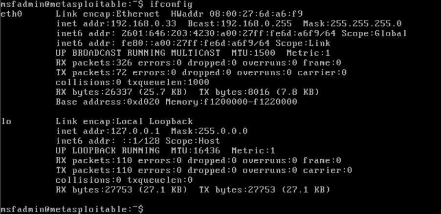
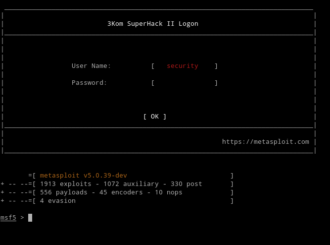
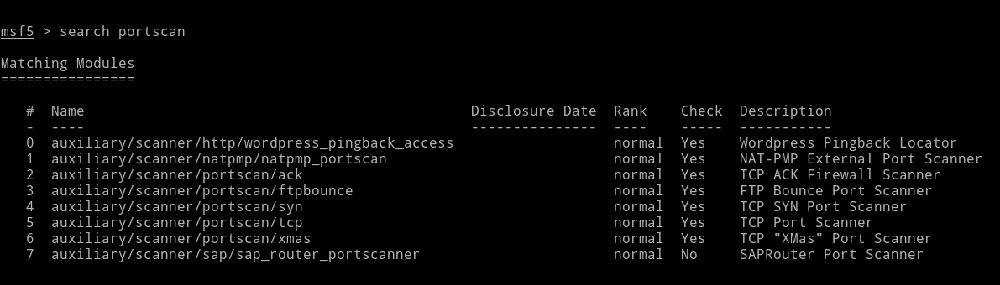
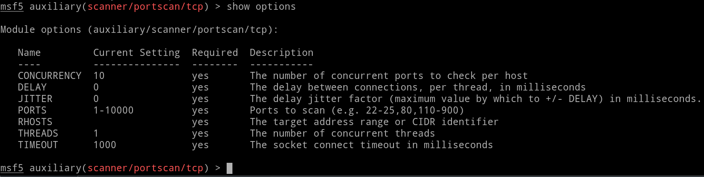
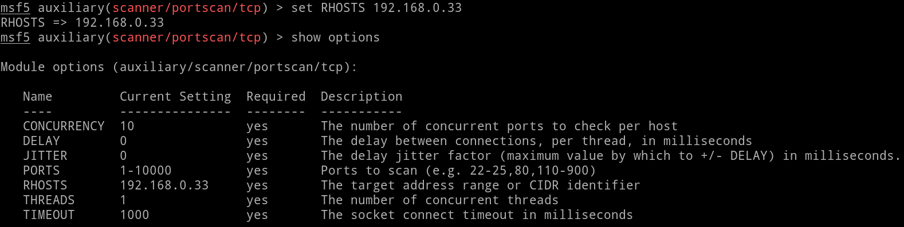
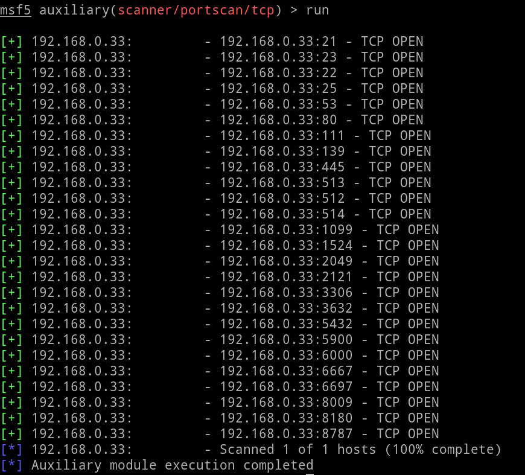

# The Port Scanner Modules

There are plenty of tools out there that let you scan for ports such as [`nmap`](https://nmap.org/download.html). However, Metasploit does come with its own module for port scanning, should you find yourself in a system that doesn't have one built in. Metasploit has a few types of port scanners available for us to use, so let's look at how to find them.

## First Steps

1. First we'll grab the ip address of the target machine by running the `ifconfig` command in the metasploitable machine which should look something like this:

2. Then, we're going to grab the `inet addr` from the second line of the output. In this case it's `192.168.0.33`. If you don't have a shared clipboard between your host and VM, or if you don't know what that means you can just jot it down somewhere and keep it handy.

3. Now, let's go back to our own computer, otherwise known as our host machine.

4. In our host machine's command line, run the command `msfconsole`. This will pull up something like following (don't worry if the ascii art isn't the same, they're generated randomly):

5. Next, we're going to search for the portscanner module by using the `search portscan` command in our msfconsole which looks like this:

## TCP Port Scanner

The first scanner we are interested in is the `tcp` port scanner. To do so we'll use the `use` command in the msfconsole like so:

`use auxiliary/scanner/portscan/tcp`

You'll know that the msfconsole is currently using the module as the indicator changes from:

`msf5 >`

To:

`msf5 auxiliary(scanner/portscan/tcp) >`

Now, we need to know HOW to use it. So, let's see what it says it needs to work. Run the following command:

`show options`

The output should be similar to the following:

The `show options` command works for all modules available in the Metasploit framework.

The `Name` column shows the names of the options that the module has.

The `Current Setting` column displays the current values of the options where blank spaces indicate that there is currently nothing there.

Some modules may come with options that can be used, but are not required, which are indicated in the `Required` column.

The `Description` column provides a one line description of the option that is available to us.

In our case, the only option that is required and not already provided is the `RHOSTS` option. Do you remember the ip address we got from step 1 in the [First Steps](#first-steps) section?

Great! We'll be using that same address here! Run the following:

`set RHOSTS <ip address>`

Where `<ip address>` equals the ip address from earlier. In my case it was `192.168.0.33`. Then, when we run `show options` again, the output should look like this:

Last step! When we run the module with the aptly named command `run` we should get an output like so:

Looks like our Metasploitable has several exposed tcp ports for us to exploit! Let's focus on that second column, more specifically the numbers that follow the colon after our ip address:

`192.168.0.33:         - 192.168.0.33:[21] - TCP OPEN`

The number between the brackets is our exposed port number. I wonder what we could do with this?
